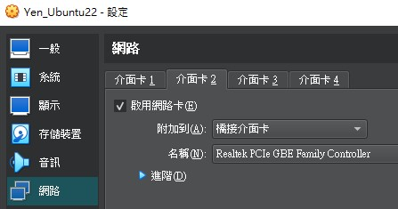
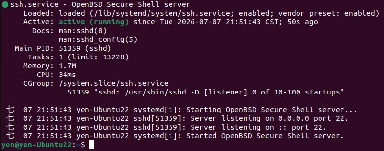

# System Validation Toolkit
### <u>Toolkit Overview</u>
- [**ssh_passwordless**](https://github.com/YenChen12/system-validation-toolkit/tree/main/ssh_passwordless): Adding public key to the server for passwordless future logins.
- [**vscode_setup**](https://github.com/YenChen12/system-validation-toolkit/tree/main/vscode_setup): VSCode settings and extensions.
- [**bashrc_custom**](https://github.com/YenChen12/system-validation-toolkit/tree/main/bashrc_custom): Optimized for workflow efficiency, creating a highly comfortable workspace.
- [**git_guide**](https://github.com/YenChen12/system-validation-toolkit/tree/main/git_guide): A reference guide that organizes commonly used git commands.


## 🎯 Remote Environment Initialization
#### Before deploying any toolkit modules, ensure your remote environment matches the specifications below and has been successfully initialized.
<details open>
<summary> Click to hide details</summary>  

### <u>System Environment</u>
- **Client:** Windows 10
- **Server:** Ubuntu 22 LTS (Virtual Box)
- **Connection:** SSH via Windows Terminal
---
### <u>Getting Started</u>
1. Configure the virtual machine to use a **second network adapter** and attach it to a **Bridged Adapter**.
    <div align="left">

    

    </div>
2. After boot-up, run `ifconfig` to retrieve the **inet** IP address of the bridged interface **enp0s8**.
    ```bash
    yen@yen-Ubuntu22:~$ ifconfig
    enp0s3: flags=4163<UP,BROADCAST,RUNNING,MULTICAST>  mtu 1500
            inet 10.0.XXX.XXX  netmask 255.255.255.0  broadcast 10.0.2.255
            inet6 XXXX::XXXX:XXXX:XXXX:XXXX  prefixlen 64  scopeid 0x20<link>
            ether XX:XX:XX:XX:XX:XX  txqueuelen 1000  (Ethernet)
            ... (RX/TX packets logs omitted for clarity) ...

    enp0s8: flags=4163<UP,BROADCAST,RUNNING,MULTICAST>  mtu 1500

            inet 192.168.XXX.XXX  netmask 255.255.255.0  broadcast 192.168.0.255
            inet6 XXXX::XXXX:XXXX:XXXX:XXXX  prefixlen 64  scopeid 0x20<link>
            ether XX:XX:XX:XX:XX:XX  txqueuelen 1000  (Ethernet)
            ... (RX/TX packets logs omitted for clarity) ...

    ... [lo is omitted as it is out of scope] ...
    ```
3. Return to the client side to initiate the remote SSH connection.
    ```bash
    yenchen12@DESKTOP-0210V8M: ~ $ ssh yen@192.168.XXX.XXX
    ssh: connect to host 192.168.XXX.XXX port 22: Connection refused
    ```
4. To verify remote configurations on the server side, execute the following commands:
    ```bash 
    yen@yen-Ubuntu22:~$ sudo systemctl status ssh
    Unit ssh.service could not be found.
    ```
    ```bash
    sudo apt-get update
    sudo apt install openssh-server -y
    ```
5. Confirm the SSH installation status.
    ```bash 
    sudo systemctl status sshd
    ```
    
6. Return to the client side and run SSH remote again to log in successfully.
    ```bash
    Guest@DESKTOP-0210V8M: ~ $ ssh yen@192.168.XXX.XXX
    The authenticity of host '192.168.XXX.XXX (192.168.XXX.XXX)' can't be established.
    ED25620 key fingerprint is SHA256:!@#$%^&*IO@#$%^&*()_+CVBGHJMK<L>:?”GHJMK<L.
    This key is not known by any other names.
    Are you sure you want to continue connecting (yes/no/[fingerprint])? yes
    Warning: Permanently added '192.168.XXX.XXX' (ED25620) to the list of known hosts.
    yen@192.168.XXX.XXX's password:
    Welcome to Ubuntu 22.04.5 LTS (GNU/Linux 6.8.0-124-generic x86_64)

    ... [Shortened for clarity] ...

    *** System restart required ***

    The programs included with the Ubuntu system are free software;
    the exact distribution terms for each program are described in the
    individual files in /usr/share/doc/*/copyright.

    Ubuntu comes with ABSOLUTELY NO WARRANTY, to the extent permitted by
    applicable law.
    Guest@DESKTOP-0210V8M: ~ $
    ```
</details>

---
**Author:** @[YenChen12](https://github.com/YenChen12)  
**Created:** 2026/07/08