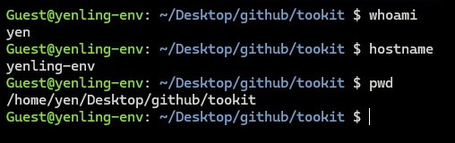
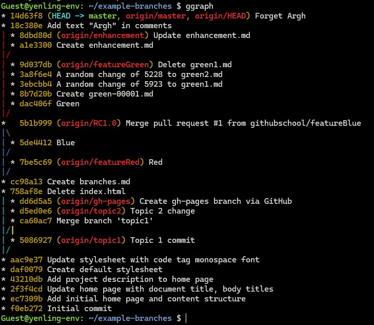

## ✨Optimized for workflow efficiency, while adding a ritualistic touch to your development environment.  

### <u>Module Overview</u>

bashrc_custom/  
    ├── [`prompt.sh`](#prompt)     # Customize styles for better visual clarity  
    ├── [`welcome.sh`](#welcome)   # Display a personalized greeting on launch  
    └── [`alias.sh`](#alias)       # Define shorthand commands for faster workflow  

> 💡 **Note**: <u>Scripts have distinct execution requirements.
Please refer to the instructions below.</u> 

---
### <u>System Environment</u>
- **Client:** Windows 10
- **Server:** Ubuntu 20.04 LTS
- **Connection:** SSH via Windows Terminal
---
### <u>Getting Started</u>
1. Set up environment configurations in `~/.bashrc` :
    ```bash
    export toolkit_path="/path/to/your/bashrc_custom"

    # Prompt custom format
    source "$toolkit_path/prompt.sh"

    # Welcome banner
    if [ -z "$SVT_WELCOME_SHOWN" ]; then
        source "$toolkit_path/welcome.sh"
        export SVT_WELCOME_SHOWN=1
    fi

    # Aliases
    source "$toolkit_path/alias.sh"
    ```
    
2. Save changes and source the configuration.
    ```bash
    source ~/.bashrc
    ```

3. Run verification to confirm the expected output.
    1. `prompt.sh`  <a id="prompt"></a>
        - Default state (unmodified):  
            
        - Modified state:  
            - **Identity (username@hostname):** Bold green  
            - **Separator:** Colon (:) for readability  
            - **Path:** Bold blue  

            

    2. `welcome.sh`  <a id="welcome"></a>
        - Default state (unmodified):
            ```bash
            Guest@DESKTOP-0210V8M: /c/WINDOWS/System32 $ ssh yen@192.168.XXX.XXX
            Welcome to Ubuntu 20.04.6 LTS (GNU/Linux 5.15.0-139-generic x86_64)

            * Documentation:  https://help.ubuntu.com
            * Management:     https://landscape.canonical.com
            * Support:        https://ubuntu.com/pro

            Expanded Security Maintenance for Infrastructure is not enabled.

            0 updates can be applied immediately.

            268 additional security updates can be applied with ESM Infra.
            Learn more about enabling ESM Infra service for Ubuntu 20.04 at
            https://ubuntu.com/20-04

            New release '22.04.5 LTS' available.
            Run 'do-release-upgrade' to upgrade to it.

            Your Hardware Enablement Stack (HWE) is supported until April 2025.
            Last login: Tue Jul  7 14:03:20 2026 from 192.168.XXX.XXX
            yen@yenling-env: ~ $
            ```
        - Modified state:
            - Displayed once upon terminal launch
            ```bash
            yenchen12@DESKTOP-0210V8M: /c/WINDOWS/System32 $ ssh yen@192.168.XXX.XXX
            Welcome to Ubuntu 20.04.6 LTS (GNU/Linux 5.15.0-139-generic x86_64)

            * Documentation:  https://help.ubuntu.com
            * Management:     https://landscape.canonical.com
            * Support:        https://ubuntu.com/pro

            Expanded Security Maintenance for Infrastructure is not enabled.

            0 updates can be applied immediately.

            268 additional security updates can be applied with ESM Infra.
            Learn more about enabling ESM Infra service for Ubuntu 20.04 at
            https://ubuntu.com/20-04

            New release '22.04.5 LTS' available.
            Run 'do-release-upgrade' to upgrade to it.

            Your Hardware Enablement Stack (HWE) is supported until April 2025.
            Last login: Tue Jul  7 14:04:51 2026 from 192.168.XXX.XXX

            __        __   _
            \ \      / /__| | ___ ___  _ __ ___   ___
             \ \ /\ / / _ \ |/ __/ _ \| '_ ` _ \ / _ \
              \ V  V /  __/ | (_| (_) | | | | | |  __/
               \_/\_/ \___|_|\___\___/|_| |_| |_|\___|


            [Task] Remember to drink 2000ml of water today.
            [Current Time] 2026/07/07 14:07:26
            Guest@yenling-env: ~ $
            ```

    3. `alias.sh`  <a id="alias"></a>
        - To apply the changes, execute the following command in your terminal:
            - **Git command**  
              - See [example-branches](https://github.com/thurwitz/example-branches#) for Git graph visualization examples
            
                
              - Shows the latest commit summary using a custom, readable format
                ```bash
                Guest@yenling-env: ~/system-validation-toolkit/bashrc_custom $ gl1f
                1072d88,Mon Jul 6 17:19:35 2026,Yen Ling,[bashrc_custom] Add initial scripts (#1)
                ```
            - **Process command** 
              - List the top 5 CPU consuming processes
                ```bash
                Guest@yenling-env: ~ $ ps_cpu5
                USER         PID %CPU %MEM    VSZ   RSS TTY      STAT START   TIME COMMAND
                yen         4730  7.3  9.4 4417596 378260 ?      Ssl  14:56   0:26 /usr/bin/gnome-shell
                yen         4543  4.0  1.9 267356 77908 tty2     Sl+  14:56   0:14 /usr/lib/xorg/Xorg vt2 -displayfd 3 -auth /run/user/1000/gdm/Xauthority -background none -noreset -keeptty -verbose 3
                yen         5061  0.8  3.1 854116 125864 ?       Sl   14:56   0:02 /snap/snap-store/1216/usr/bin/snap-store --gapplication-service
                root          34  0.6  0.0      0     0 ?        S    14:50   0:04 [ksoftirqd/3]
                root         699  0.6  1.0 2070832 40860 ?       Ssl  14:50   0:04 /usr/lib/snapd/snapd
                ```    
              - To terminate all processes owned by a specific user
                ```bash
                Guest@yenling-env: ~/system-validation-toolkit/bashrc_custom $ kuser root
                pkill: killing pid 1 failed: Operation not permitted

                # Terminating all your user processes will end your session
                Guest@yenling-env: ~/system-validation-toolkit/bashrc_custom $ kuser yen
                Connection to 192.168.XXX.XXX closed by remote host.
                Connection to 192.168.XXX.XXX closed.
                Guest@DESKTOP-0210V8M: ~/github/system-validation-toolkit/bashrc_custom $
                ```
            - **Find command**         
              - Search for a File
                ```bash
                # Exact Search
                Guest@yenling-env: ~ $ ffile alias.sh
                ./system-validation-toolkit/bashrc_custom/alias.sh

                # Fuzzy Search
                Guest@yenling-env: ~ $ ffile "*.sh"
                ./Desktop/0603test/test.sh
                ./Desktop/0603test/linux_booting.sh
                ./system-validation-toolkit/bashrc_custom/test.sh
                ```
              - Search for a Folder
                ```bash
                # Exact Search
                Guest@yenling-env: ~ $ ffolder example-branches
                ./example-branches

                # Fuzzy Search
                Guest@yenling-env: ~ $ ffolder "*Do*"
                ./Documents
                ./Downloads
                ./.config/google-chrome/Default/Download Service
                ```
---
**Author:** @[YenChen12](https://github.com/YenChen12)  
**Created:** 2026/07/07