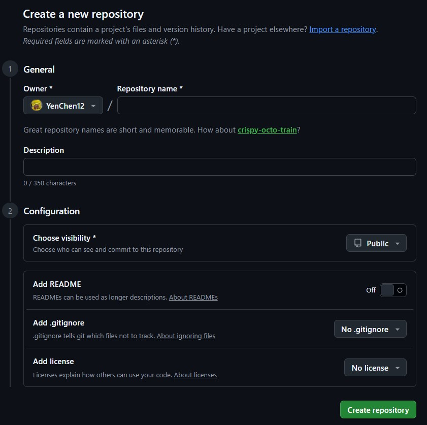
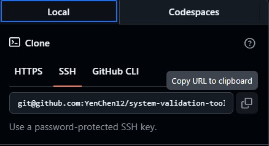

## 💪 Environment Initialization

### <u>Getting Started</u>
1. Global Account Configuration, set up identity before any local git actions.
    ```bash
    git config --global user.name <your name>
    git config --global user.email <your email>
    cat ~/.gitconfig    # Verify the identity info
    ```
2. Configure SSH Authentication for a secure handshake between your local machine and GitHub.
    - Please refer to [setup_ssh.md](https://gist.github.com/YenChen12/e3212417299f84e9fba4eec87d177043#file-setup_ssh-md) for the details.

3. Create the repository via Web UI and initialize the project directly on GitHub.
    - Dynamic configuration based on workflow
    <div align="left">

    

    </div>
4. Clone to local machine and confirm that the SSH key setup is correct before pulling the repository.
    <div align="left">

    

    </div>
5. Push the first commit to ensure end-to-end connection.
    ```bash
    touch <file.sh>    # Various file types
    git add <file.sh>
    git commit -m "Initial commit"
    git push <remote> <branch>
    ```
---
💡 Edge Case:  
- While initializing a **local project** to track files from scratch, use `git init` to set up the repository manually.
    ```bash
    cd my_workspace
    git init
    # Execute various git commands as needed
    ```
---
**Author:** @[YenChen12](https://github.com/YenChen12)  
**Created:** 2026/07/09