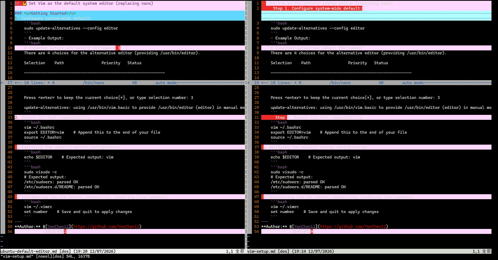

## 💪 File comparison and operation workflows for Vim environments

### <u>Getting Started</u>
1. Comparing files and actual use cases.
    ```bash
    vimdiff <File A> <File B>
    ```
    <div align="left">

    
    
    </div>

2. Vimdiff advanced commands.  
    >💡 Note:  
        - Press **Esc** to return to **Normal Mode**.  
        - All commands starting with **:** require **pressing Enter to execute**.

    1. Session controls:
        - `:wa` Save all modified files
        - `:qa` Quit all windows
        - `:wqa` Save all modified files and quit all windows
    2. Window layout:
        - `Ctrl + w` + `v` Vertical split
        - `Ctrl + w` + `s` Horizontal split
        - `Ctrl + w` + `w` Switch between windows
        - `Ctrl + w` + `q` Close current window
---  
**Author:** @[YenChen12](https://github.com/YenChen12)  
**Created:** 2026/07/12