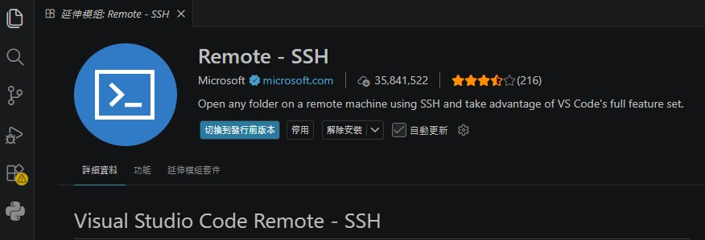
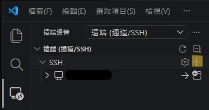
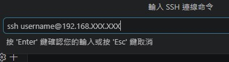
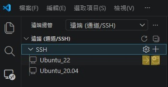
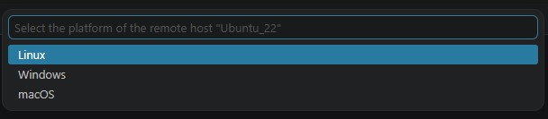
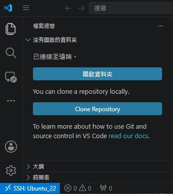
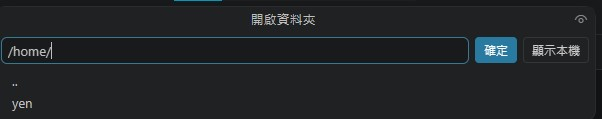
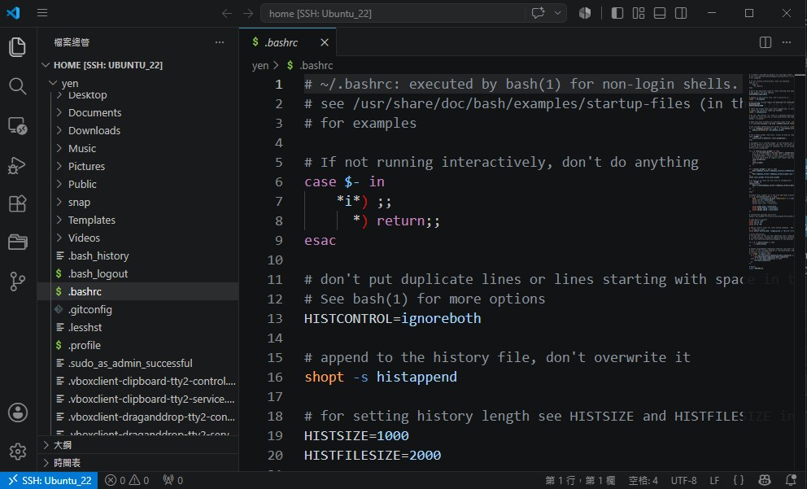

## ✨ VSCode Remote - SSH Setup

### <u>System Environment</u>
- **Client:** Windows 10
- **Server:** Ubuntu 22.04 LTS
- **Connection:** SSH via Visual Studio Code
---
### <u>Getting Started</u>
1. VSCode and install the **Remote SSH** extension.
    
2. Click the marked area to **add new SSH host**.
    <div align="left">

    
    
    
    </div>
3. Configure the `config` file and save the changes.
    ```bash
    # Path: `/c/Users/username/.ssh/config`

    Host <Custom Hostname>
     HostName 192.168.XXX.XXX
     User username
    ```  
4. Connect to the server.
    - Left icon to open in the current window
    - Right icon to open in a new window
    <div align="left">

    

    </div>
5. Select the OS that matches the local system.
    <div align="left">

    

    </div>
6. Open the workspace folder at the designated path.
    <div align="left">

    
    

    </div>
7. Once the remote connection is successful, files under the directory will be accessible.
    
---
**Author:** @[YenChen12](https://github.com/YenChen12)  
**Created:** 2026/07/08